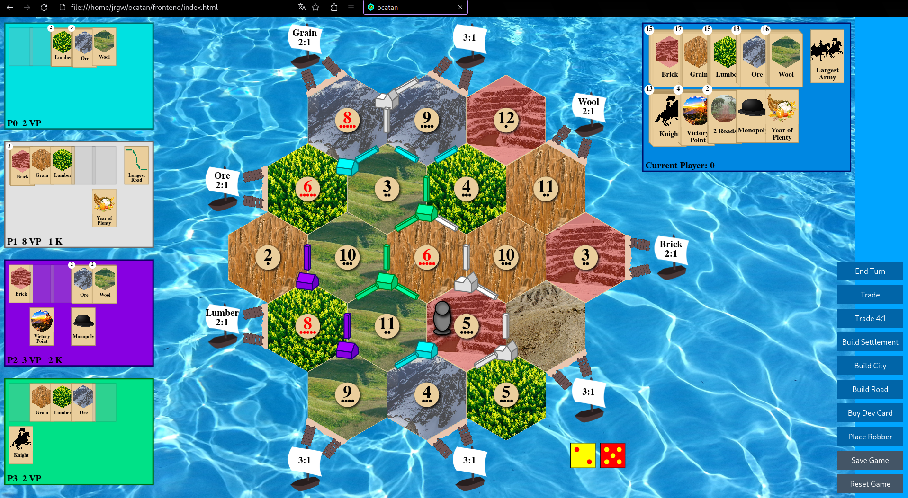

# ocatan 
Settlers of Catan AI



## Dev Setup

First, clone the repository and enter the directory.
Create a Python virtual environment & install requirements. Specifics of 
creating venv may vary; see [here](https://docs.python.org/3/library/venv.html) for help.
```
python -m venv venv
source ./venv/bin/activate
pip install -r requirements.txt
```

## Running the program

To run the program with the visual display, simply start the python script 
first and then open index.html in a browser. 
```
python ./main.py
firefox ./frontend/index.html
```

The default settings involve the GUI, with a single human player against 3 weak
AI agents. 
Use the command `python ./main.py -h` to view the help. It will indicate how to
run the various settings for the program, including choosing between 2 and 4 
players and their agent type with the '-p <players string>' argument. All of the 
optional arguments are important for running the program with different settings. 

Here are some example commands to get you started:
This runs a game of expectimax vs random with random seed=42 for reproduction, `-n` for no 
gui, and `-g 1` is just restating the default of running a single game.
```
python main.py -p ER --seed 42 -n -g 1
```
The below command runs a game of the Victory-Point greedy agent vs the random 
greedy agent and two other random agents, for 100 games. After running any number 
of non-gui games, the program will output statistics. With the `-s` option it will also
save stats to `stats.csv`.
```
python main.py -p VGR --seed 0 -n -g 100 -s
```
This command will run a game of the frontend controlled by a human versus
the victory-point greedy agent and two random agents. Note that the frontend is designed to look best when in full-screen on a 16:9 display. Hitting F11 to enter fullscreen is the optimal way to use the frontend.
```
python main.py -p HVRR
```
This command will run a saved game from file, that was saved in a previous run of 
the program. Note that we use the `-a` argument to have it automatically play 
through the entire game for our review, rather than the default of waiting for 
us to click "End Turn" in the frontend to step through the game.
```
python main.py -r ./games/example_json_game.json -a
```


## Nomenclature standards
Within the code, certain names are standardized to improve readability and 
maintainability.

Most resource hexes could be identified by different names, at the very least 
differing based on references to the environment portrayed by the hex, or the 
actual resource it produces (e.g. "Forest" hex vs "Lumber"/"Wood" hex).
Therefore, the following names and abbreviations have been used throughout the 
codebase to refer to the hexes and the resources they yield:
Brick   (B)
Grain   (G)
Lumber  (L)
Ore     (O)
Wool    (W)
Desert  (D)
Water   (E) (Sometimes useful to denote the shoreline locations; 'E' for empty)

In any case, throughout the codebase constants are used to maintain readability 
and maintainability.


## File structure
The program is split into two distinct sections, for the frontend and backend. 
They communicate via websockets, including for human input while the program is 
running. The frontend is designed in a straightforward manner, with the single 
page in `index.html`, which loads `script.js` for all of the logic, written in vanilla 
javascript. 

The backend is split into more files. Here is a summary of the most important 
files:

```
├── Agents.py           # Catan-playing agent classes
├── BoardConnect.py     # Testing file for websockets
├── constants.py        # Global constants
├── frontend            # GUI
│   ├── ...
│   ├── index.html      # Frontend page to load in browser
│   ├── script.js       # Frontend logic; display & communication
│   ├── static
│   │   └── img
│   │       └── ...
│   └── style.css
├── GameBoard.py        # Game logic functions
├── main.py             # Primary program; parses args; game loop
├── ...
├── README.md
├── games/              # Saved .json games for replay/review; not tracked by git
├── boards/             # Saved .json board states for reuse/continuation; not tracked by git
├── stats.csv           # Saved game statistics; not tracked by git
├── requirements.txt    # Python pip requirements
└── util.py             # Variety of utility fns; overlap with GameBoard.py
```

## Limitations
There are numerous limitations in the program as it stands right now. One that 
you may notice is that the implementation of human moves in the frontend is 
slightly behind the implemented game logic in the backend. There are certain 
moves which AI players can select, but which human players have no recourse for 
in the GUI. 

The limitations exist both as a function of the work it takes to fully implement 
all Catan game logic properly, and also as a simplification effort for the AI's 
to run well.
Here are some of the limitations that may be worth noting:

* The expectimax agent is quite slow, and uses a very basic evaluation function 
currently to achieve decent results while being as efficient as possible
* Use of the monopoly and year of plenty cards are not yet implemented, so when
they are bought they are essentially duds
* Currently, only 4:1 bank trades are functioning
* This project was primarily tested on a single linux system with Firefox for the frontend browser. This shouldn't cause issues for the most part, but other systems might display frontend elements like text font somewhat differently.


## Troubleshooting
As mentioned above, there are still a variety of limitations to the program 
that are being worked on. To some extent, reading into the game files, particularly 
main.py, may be the most helpful if you run into issues. This section can also
be updated with common issues as we come across them.

* Note that the backend python program always has to be running before loading 
the frontend `index.html` in the browser. Refresh the page if it is perpetually loading
* If the frontend says it disconnected, then double check that the backend is working 
fine. Once the backend is running properly, refresh `index.html` to reconnect.
